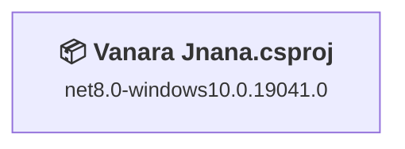
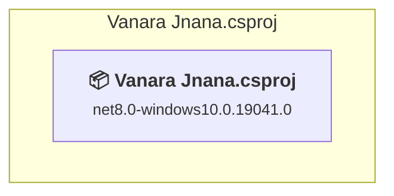

# Projects and dependencies analysis

This document provides a comprehensive overview of the projects and their dependencies in the context of upgrading to .NETCoreApp,Version=v10.0.

## Table of Contents

- [Executive Summary](#executive-Summary)
  - [Highlevel Metrics](#highlevel-metrics)
  - [Projects Compatibility](#projects-compatibility)
  - [Package Compatibility](#package-compatibility)
  - [API Compatibility](#api-compatibility)
  - [Binding Redirect Configuration](#binding-redirect-configuration)
- [Aggregate NuGet packages details](#aggregate-nuget-packages-details)
- [Top API Migration Challenges](#top-api-migration-challenges)
  - [Technologies and Features](#technologies-and-features)
  - [Most Frequent API Issues](#most-frequent-api-issues)
- [Projects Relationship Graph](#projects-relationship-graph)
- [Project Details](#project-details)

  - [Vanara Jnana.csproj](#vanara-jnanacsproj)

## Executive Summary

### Highlevel Metrics

| Metric | Count | Status |
| :--- | :---: | :--- |
| Total Projects | 1 | All require upgrade |
| Total NuGet Packages | 124 | 4 need upgrade |
| Total Code Files | 70 |  |
| Total Code Files with Incidents | 8 |  |
| Total Lines of Code | 2934 |  |
| Total Number of Issues | 45 |  |
| Estimated LOC to modify | 38+ | at least 1,3% of codebase |

### Projects Compatibility

| Project | Target Framework | Difficulty | Package Issues | API Issues | Binding Issues | Est. LOC Impact | Description |
| :--- | :---: | :---: | :---: | :---: | :---: | :---: | :--- |
| [Vanara Jnana.csproj](#vanara-jnanacsproj) | net8.0-windows10.0.19041.0 | 🟢 Low | 6 | 38 | 0 | 38+ | WinForms, Sdk Style = True |

### Package Compatibility

| Status | Count | Percentage |
| :--- | :---: | :---: |
| ✅ Compatible | 120 | 96,8% |
| ⚠️ Incompatible | 2 | 1,6% |
| 🔄 Upgrade Recommended | 2 | 1,6% |
| ***Total NuGet Packages*** | ***124*** | ***100%*** |

### API Compatibility

| Category | Count | Impact |
| :--- | :---: | :--- |
| 🔴 Binary Incompatible | 0 | High - Require code changes |
| 🟡 Source Incompatible | 30 | Medium - Needs re-compilation and potential conflicting API error fixing |
| 🔵 Behavioral change | 8 | Low - Behavioral changes that may require testing at runtime |
| ✅ Compatible | 2310 |  |
| ***Total APIs Analyzed*** | ***2348*** |  |

## Aggregate NuGet packages details

| Package | Current Version | Suggested Version | Projects | Description |
| :--- | :---: | :---: | :--- | :--- |
| ColorCode.Core | 2.0.15 |  | [Vanara Jnana.csproj](#vanara-jnanacsproj) | ✅Compatible |
| ColorCode.WinUI | 2.0.15 |  | [Vanara Jnana.csproj](#vanara-jnanacsproj) | ⚠️NuGet package is incompatible |
| CommunityToolkit.Common | 7.1.2 |  | [Vanara Jnana.csproj](#vanara-jnanacsproj) | ✅Compatible |
| CommunityToolkit.Mvvm | 8.4.2 |  | [Vanara Jnana.csproj](#vanara-jnanacsproj) | ✅Compatible |
| CommunityToolkit.WinUI | 7.1.2 |  | [Vanara Jnana.csproj](#vanara-jnanacsproj) | ✅Compatible |
| CommunityToolkit.WinUI.UI | 7.1.2 |  | [Vanara Jnana.csproj](#vanara-jnanacsproj) | ✅Compatible |
| CommunityToolkit.WinUI.UI.Controls.Core | 7.1.2 |  | [Vanara Jnana.csproj](#vanara-jnanacsproj) | ✅Compatible |
| CommunityToolkit.WinUI.UI.Controls.Markdown | 7.1.2 |  | [Vanara Jnana.csproj](#vanara-jnanacsproj) | ⚠️NuGet package is incompatible |
| CommunityToolkit.WinUI.UI.Controls.Primitives | 7.1.2 |  | [Vanara Jnana.csproj](#vanara-jnanacsproj) | ✅Compatible |
| fuselibs-desktop-fonts | 1.0.0 |  | [Vanara Jnana.csproj](#vanara-jnanacsproj) | ✅Compatible |
| Microsoft.Extensions.Caching.Abstractions | 11.0.0-rc.1.26425.128 | 10.0.12 | [Vanara Jnana.csproj](#vanara-jnanacsproj) | NuGet package upgrade is recommended |
| Microsoft.Extensions.Caching.Memory | 11.0.0-rc.1.26425.128 | 10.0.12 | [Vanara Jnana.csproj](#vanara-jnanacsproj) | NuGet package upgrade is recommended |
| Microsoft.Extensions.DependencyInjection.Abstractions | 11.0.0-rc.1.26425.128 |  | [Vanara Jnana.csproj](#vanara-jnanacsproj) | ✅Compatible |
| Microsoft.Extensions.Logging.Abstractions | 11.0.0-rc.1.26425.128 |  | [Vanara Jnana.csproj](#vanara-jnanacsproj) | ✅Compatible |
| Microsoft.Extensions.Options | 11.0.0-rc.1.26425.128 |  | [Vanara Jnana.csproj](#vanara-jnanacsproj) | ✅Compatible |
| Microsoft.Extensions.Primitives | 11.0.0-rc.1.26425.128 |  | [Vanara Jnana.csproj](#vanara-jnanacsproj) | ✅Compatible |
| Microsoft.Identity.Client | 4.89.0 |  | [Vanara Jnana.csproj](#vanara-jnanacsproj) | ✅Compatible |
| Microsoft.IdentityModel.Abstractions | 8.14.0 |  | [Vanara Jnana.csproj](#vanara-jnanacsproj) | ✅Compatible |
| Microsoft.NETCore.Platforms | 1.1.1 |  | [Vanara Jnana.csproj](#vanara-jnanacsproj) | ✅Compatible |
| Microsoft.NETCore.Targets | 1.1.3 |  | [Vanara Jnana.csproj](#vanara-jnanacsproj) | ✅Compatible |
| Microsoft.Web.WebView2 | 1.0.3719.77 |  | [Vanara Jnana.csproj](#vanara-jnanacsproj) | ✅Compatible |
| Microsoft.Win32.SystemEvents | 10.0.2 |  | [Vanara Jnana.csproj](#vanara-jnanacsproj) | ✅Compatible |
| Microsoft.Windows.AI.MachineLearning | 2.4.66-preview |  | [Vanara Jnana.csproj](#vanara-jnanacsproj) | ✅Compatible |
| Microsoft.Windows.SDK.BuildTools | 10.0.29648.1000-preview |  | [Vanara Jnana.csproj](#vanara-jnanacsproj) | ✅Compatible |
| Microsoft.Windows.SDK.BuildTools.MSIX | 1.7.251221100 |  | [Vanara Jnana.csproj](#vanara-jnanacsproj) | ✅Compatible |
| Microsoft.WindowsAppSDK | 2.4.1-experimental |  | [Vanara Jnana.csproj](#vanara-jnanacsproj) | ✅Compatible |
| Microsoft.WindowsAppSDK.AI | 2.4.8-experimental |  | [Vanara Jnana.csproj](#vanara-jnanacsproj) | ✅Compatible |
| Microsoft.WindowsAppSDK.Base | 2.0.5-experimental2 |  | [Vanara Jnana.csproj](#vanara-jnanacsproj) | ✅Compatible |
| Microsoft.WindowsAppSDK.DWrite | 2.1.1-experimental |  | [Vanara Jnana.csproj](#vanara-jnanacsproj) | ✅Compatible |
| Microsoft.WindowsAppSDK.Foundation | 2.3.11-experimental |  | [Vanara Jnana.csproj](#vanara-jnanacsproj) | ✅Compatible |
| Microsoft.WindowsAppSDK.InteractiveExperiences | 2.1.7-experimental |  | [Vanara Jnana.csproj](#vanara-jnanacsproj) | ✅Compatible |
| Microsoft.WindowsAppSDK.ML | 2.2.11-experimental |  | [Vanara Jnana.csproj](#vanara-jnanacsproj) | ✅Compatible |
| Microsoft.WindowsAppSDK.Runtime | 2.4.1-experimental |  | [Vanara Jnana.csproj](#vanara-jnanacsproj) | ✅Compatible |
| Microsoft.WindowsAppSDK.Search | 2.4.8-experimental |  | [Vanara Jnana.csproj](#vanara-jnanacsproj) | ✅Compatible |
| Microsoft.WindowsAppSDK.Widgets | 2.0.6-experimental |  | [Vanara Jnana.csproj](#vanara-jnanacsproj) | ✅Compatible |
| Microsoft.WindowsAppSDK.WinUI | 2.3.8-experimental |  | [Vanara Jnana.csproj](#vanara-jnanacsproj) | ✅Compatible |
| Newtonsoft.Json | 13.0.3 |  | [Vanara Jnana.csproj](#vanara-jnanacsproj) | ✅Compatible |
| NuGet.Common | 7.9.0 |  | [Vanara Jnana.csproj](#vanara-jnanacsproj) | ✅Compatible |
| NuGet.Configuration | 7.9.0 |  | [Vanara Jnana.csproj](#vanara-jnanacsproj) | ✅Compatible |
| NuGet.DependencyResolver.Core | 7.9.0 |  | [Vanara Jnana.csproj](#vanara-jnanacsproj) | ✅Compatible |
| NuGet.Frameworks | 7.9.0 |  | [Vanara Jnana.csproj](#vanara-jnanacsproj) | ✅Compatible |
| NuGet.LibraryModel | 7.9.0 |  | [Vanara Jnana.csproj](#vanara-jnanacsproj) | ✅Compatible |
| NuGet.Packaging | 7.9.0 |  | [Vanara Jnana.csproj](#vanara-jnanacsproj) | ✅Compatible |
| NuGet.ProjectModel | 7.9.0 |  | [Vanara Jnana.csproj](#vanara-jnanacsproj) | ✅Compatible |
| NuGet.Protocol | 7.9.0 |  | [Vanara Jnana.csproj](#vanara-jnanacsproj) | ✅Compatible |
| NuGet.Versioning | 7.9.0 |  | [Vanara Jnana.csproj](#vanara-jnanacsproj) | ✅Compatible |
| runtime.debian.8-x64.runtime.native.System.Security.Cryptography.OpenSsl | 4.3.2 |  | [Vanara Jnana.csproj](#vanara-jnanacsproj) | ✅Compatible |
| runtime.fedora.23-x64.runtime.native.System.Security.Cryptography.OpenSsl | 4.3.2 |  | [Vanara Jnana.csproj](#vanara-jnanacsproj) | ✅Compatible |
| runtime.fedora.24-x64.runtime.native.System.Security.Cryptography.OpenSsl | 4.3.2 |  | [Vanara Jnana.csproj](#vanara-jnanacsproj) | ✅Compatible |
| runtime.native.System | 4.3.0 |  | [Vanara Jnana.csproj](#vanara-jnanacsproj) | ✅Compatible |
| runtime.native.System.Net.Http | 4.3.0 |  | [Vanara Jnana.csproj](#vanara-jnanacsproj) | ✅Compatible |
| runtime.native.System.Security.Cryptography.Apple | 4.3.0 |  | [Vanara Jnana.csproj](#vanara-jnanacsproj) | ✅Compatible |
| runtime.native.System.Security.Cryptography.OpenSsl | 4.3.2 |  | [Vanara Jnana.csproj](#vanara-jnanacsproj) | ✅Compatible |
| runtime.opensuse.13.2-x64.runtime.native.System.Security.Cryptography.OpenSsl | 4.3.2 |  | [Vanara Jnana.csproj](#vanara-jnanacsproj) | ✅Compatible |
| runtime.opensuse.42.1-x64.runtime.native.System.Security.Cryptography.OpenSsl | 4.3.2 |  | [Vanara Jnana.csproj](#vanara-jnanacsproj) | ✅Compatible |
| runtime.osx.10.10-x64.runtime.native.System.Security.Cryptography.Apple | 4.3.0 |  | [Vanara Jnana.csproj](#vanara-jnanacsproj) | ✅Compatible |
| runtime.osx.10.10-x64.runtime.native.System.Security.Cryptography.OpenSsl | 4.3.2 |  | [Vanara Jnana.csproj](#vanara-jnanacsproj) | ✅Compatible |
| runtime.rhel.7-x64.runtime.native.System.Security.Cryptography.OpenSsl | 4.3.2 |  | [Vanara Jnana.csproj](#vanara-jnanacsproj) | ✅Compatible |
| runtime.ubuntu.14.04-x64.runtime.native.System.Security.Cryptography.OpenSsl | 4.3.2 |  | [Vanara Jnana.csproj](#vanara-jnanacsproj) | ✅Compatible |
| runtime.ubuntu.16.04-x64.runtime.native.System.Security.Cryptography.OpenSsl | 4.3.2 |  | [Vanara Jnana.csproj](#vanara-jnanacsproj) | ✅Compatible |
| runtime.ubuntu.16.10-x64.runtime.native.System.Security.Cryptography.OpenSsl | 4.3.2 |  | [Vanara Jnana.csproj](#vanara-jnanacsproj) | ✅Compatible |
| System.Buffers | 4.6.1 |  | [Vanara Jnana.csproj](#vanara-jnanacsproj) | ✅Compatible |
| System.Collections | 4.3.0 |  | [Vanara Jnana.csproj](#vanara-jnanacsproj) | ✅Compatible |
| System.Collections.Concurrent | 4.3.0 |  | [Vanara Jnana.csproj](#vanara-jnanacsproj) | ✅Compatible |
| System.ComponentModel.Annotations | 5.0.0 |  | [Vanara Jnana.csproj](#vanara-jnanacsproj) | ✅Compatible |
| System.Configuration.ConfigurationManager | 10.0.2 |  | [Vanara Jnana.csproj](#vanara-jnanacsproj) | ✅Compatible |
| System.Diagnostics.Debug | 4.3.0 |  | [Vanara Jnana.csproj](#vanara-jnanacsproj) | ✅Compatible |
| System.Diagnostics.DiagnosticSource | 11.0.0-rc.1.26425.128 |  | [Vanara Jnana.csproj](#vanara-jnanacsproj) | ✅Compatible |
| System.Diagnostics.EventLog | 10.0.2 |  | [Vanara Jnana.csproj](#vanara-jnanacsproj) | ✅Compatible |
| System.Diagnostics.Tracing | 4.3.0 |  | [Vanara Jnana.csproj](#vanara-jnanacsproj) | ✅Compatible |
| System.Drawing.Common | 10.0.2 |  | [Vanara Jnana.csproj](#vanara-jnanacsproj) | ✅Compatible |
| System.Globalization | 4.3.0 |  | [Vanara Jnana.csproj](#vanara-jnanacsproj) | ✅Compatible |
| System.Globalization.Calendars | 4.3.0 |  | [Vanara Jnana.csproj](#vanara-jnanacsproj) | ✅Compatible |
| System.Globalization.Extensions | 4.3.0 |  | [Vanara Jnana.csproj](#vanara-jnanacsproj) | ✅Compatible |
| System.IO | 4.3.0 |  | [Vanara Jnana.csproj](#vanara-jnanacsproj) | ✅Compatible |
| System.IO.FileSystem | 4.3.0 |  | [Vanara Jnana.csproj](#vanara-jnanacsproj) | ✅Compatible |
| System.IO.FileSystem.Primitives | 4.3.0 |  | [Vanara Jnana.csproj](#vanara-jnanacsproj) | ✅Compatible |
| System.Linq | 4.3.0 |  | [Vanara Jnana.csproj](#vanara-jnanacsproj) | ✅Compatible |
| System.Memory | 4.6.3 |  | [Vanara Jnana.csproj](#vanara-jnanacsproj) | ✅Compatible |
| System.Net.Http | 4.3.4 |  | [Vanara Jnana.csproj](#vanara-jnanacsproj) | NuGet package functionality is included with framework reference |
| System.Net.Primitives | 4.3.0 |  | [Vanara Jnana.csproj](#vanara-jnanacsproj) | ✅Compatible |
| System.Numerics.Tensors | 9.0.0 |  | [Vanara Jnana.csproj](#vanara-jnanacsproj) | ✅Compatible |
| System.Private.Uri | 4.3.2 |  | [Vanara Jnana.csproj](#vanara-jnanacsproj) | ✅Compatible |
| System.Reflection | 4.3.0 |  | [Vanara Jnana.csproj](#vanara-jnanacsproj) | ✅Compatible |
| System.Reflection.Primitives | 4.3.0 |  | [Vanara Jnana.csproj](#vanara-jnanacsproj) | ✅Compatible |
| System.Resources.ResourceManager | 4.3.0 |  | [Vanara Jnana.csproj](#vanara-jnanacsproj) | ✅Compatible |
| System.Runtime | 4.3.1 |  | [Vanara Jnana.csproj](#vanara-jnanacsproj) | ✅Compatible |
| System.Runtime.CompilerServices.Unsafe | 6.1.2 |  | [Vanara Jnana.csproj](#vanara-jnanacsproj) | ✅Compatible |
| System.Runtime.Extensions | 4.3.0 |  | [Vanara Jnana.csproj](#vanara-jnanacsproj) | ✅Compatible |
| System.Runtime.Handles | 4.3.0 |  | [Vanara Jnana.csproj](#vanara-jnanacsproj) | ✅Compatible |
| System.Runtime.InteropServices | 4.3.0 |  | [Vanara Jnana.csproj](#vanara-jnanacsproj) | ✅Compatible |
| System.Runtime.Numerics | 4.3.0 |  | [Vanara Jnana.csproj](#vanara-jnanacsproj) | ✅Compatible |
| System.Security.Cryptography.Algorithms | 4.3.0 |  | [Vanara Jnana.csproj](#vanara-jnanacsproj) | ✅Compatible |
| System.Security.Cryptography.Cng | 4.3.0 |  | [Vanara Jnana.csproj](#vanara-jnanacsproj) | ✅Compatible |
| System.Security.Cryptography.Csp | 4.3.0 |  | [Vanara Jnana.csproj](#vanara-jnanacsproj) | ✅Compatible |
| System.Security.Cryptography.Encoding | 4.3.0 |  | [Vanara Jnana.csproj](#vanara-jnanacsproj) | ✅Compatible |
| System.Security.Cryptography.OpenSsl | 4.3.0 |  | [Vanara Jnana.csproj](#vanara-jnanacsproj) | ✅Compatible |
| System.Security.Cryptography.Pkcs | 8.0.1 |  | [Vanara Jnana.csproj](#vanara-jnanacsproj) | ✅Compatible |
| System.Security.Cryptography.Primitives | 4.3.0 |  | [Vanara Jnana.csproj](#vanara-jnanacsproj) | ✅Compatible |
| System.Security.Cryptography.ProtectedData | 10.0.2 |  | [Vanara Jnana.csproj](#vanara-jnanacsproj) | ✅Compatible |
| System.Security.Cryptography.X509Certificates | 4.3.0 |  | [Vanara Jnana.csproj](#vanara-jnanacsproj) | ✅Compatible |
| System.Security.Permissions | 10.0.2 |  | [Vanara Jnana.csproj](#vanara-jnanacsproj) | ✅Compatible |
| System.Text.Encoding | 4.3.0 |  | [Vanara Jnana.csproj](#vanara-jnanacsproj) | ✅Compatible |
| System.Text.RegularExpressions | 4.3.1 |  | [Vanara Jnana.csproj](#vanara-jnanacsproj) | NuGet package functionality is included with framework reference |
| System.Threading | 4.3.0 |  | [Vanara Jnana.csproj](#vanara-jnanacsproj) | ✅Compatible |
| System.Threading.Tasks | 4.3.0 |  | [Vanara Jnana.csproj](#vanara-jnanacsproj) | ✅Compatible |
| System.Threading.Tasks.Extensions | 4.6.3 |  | [Vanara Jnana.csproj](#vanara-jnanacsproj) | ✅Compatible |
| System.Windows.Extensions | 10.0.2 |  | [Vanara Jnana.csproj](#vanara-jnanacsproj) | ✅Compatible |
| Vanara.Core | 5.0.7 |  | [Vanara Jnana.csproj](#vanara-jnanacsproj) | ✅Compatible |
| Vanara.PInvoke.ComCtl32 | 5.0.7 |  | [Vanara Jnana.csproj](#vanara-jnanacsproj) | ✅Compatible |
| Vanara.PInvoke.Cryptography | 5.0.7 |  | [Vanara Jnana.csproj](#vanara-jnanacsproj) | ✅Compatible |
| Vanara.PInvoke.Gdi32 | 5.0.7 |  | [Vanara Jnana.csproj](#vanara-jnanacsproj) | ✅Compatible |
| Vanara.PInvoke.Kernel32 | 5.0.7 |  | [Vanara Jnana.csproj](#vanara-jnanacsproj) | ✅Compatible |
| Vanara.PInvoke.Ole | 5.0.7 |  | [Vanara Jnana.csproj](#vanara-jnanacsproj) | ✅Compatible |
| Vanara.PInvoke.Rpc | 5.0.7 |  | [Vanara Jnana.csproj](#vanara-jnanacsproj) | ✅Compatible |
| Vanara.PInvoke.SearchApi | 5.0.7 |  | [Vanara Jnana.csproj](#vanara-jnanacsproj) | ✅Compatible |
| Vanara.PInvoke.Security | 5.0.7 |  | [Vanara Jnana.csproj](#vanara-jnanacsproj) | ✅Compatible |
| Vanara.PInvoke.Shared | 5.0.0 |  | [Vanara Jnana.csproj](#vanara-jnanacsproj) | ✅Compatible |
| Vanara.PInvoke.Shell32 | 5.0.7 |  | [Vanara Jnana.csproj](#vanara-jnanacsproj) | ✅Compatible |
| Vanara.PInvoke.ShlwApi | 5.0.7 |  | [Vanara Jnana.csproj](#vanara-jnanacsproj) | ✅Compatible |
| Vanara.PInvoke.User32 | 5.0.7 |  | [Vanara Jnana.csproj](#vanara-jnanacsproj) | ✅Compatible |
| Vanara.Windows.Extensions | 5.0.7 |  | [Vanara Jnana.csproj](#vanara-jnanacsproj) | ✅Compatible |
| Vanara.Windows.Shell | 5.0.7 |  | [Vanara Jnana.csproj](#vanara-jnanacsproj) | ✅Compatible |
| Vanara.Windows.Shell.Common | 5.0.7 |  | [Vanara Jnana.csproj](#vanara-jnanacsproj) | ✅Compatible |

## Top API Migration Challenges

### Technologies and Features

| Technology | Issues | Percentage | Migration Path |
| :--- | :---: | :---: | :--- |

### Most Frequent API Issues

| API | Count | Percentage | Category |
| :--- | :---: | :---: | :--- |
| T:Windows.UI.Color | 11 | 28,9% | Source Incompatible |
| T:Windows.Foundation.Point | 9 | 23,7% | Source Incompatible |
| M:Windows.UI.Color.FromArgb(System.Byte,System.Byte,System.Byte,System.Byte) | 3 | 7,9% | Source Incompatible |
| P:System.Environment.OSVersion | 3 | 7,9% | Behavioral Change |
| M:System.TimeSpan.FromSeconds(System.Double) | 2 | 5,3% | Source Incompatible |
| T:System.Uri | 2 | 5,3% | Behavioral Change |
| M:System.Uri.#ctor(System.String) | 2 | 5,3% | Behavioral Change |
| T:Windows.Foundation.Size | 2 | 5,3% | Source Incompatible |
| M:Windows.Foundation.Point.#ctor(System.Double,System.Double) | 2 | 5,3% | Source Incompatible |
| M:Windows.Foundation.Size.#ctor(System.Double,System.Double) | 1 | 2,6% | Source Incompatible |
| P:System.Uri.AbsolutePath | 1 | 2,6% | Behavioral Change |

## Projects Relationship Graph

Legend:
📦 SDK-style project
⚙️ Classic project

## Project Details

### Vanara Jnana.csproj

#### Project Info

- **Current Target Framework:** net8.0-windows10.0.19041.0
- **Proposed Target Framework:** net10.0-windows10.0.22000.0
- **SDK-style**: True
- **Project Kind:** WinForms
- **Dependencies**: 0
- **Dependants**: 0
- **Number of Files**: 270
- **Number of Files with Incidents**: 8
- **Lines of Code**: 2934
- **Estimated LOC to modify**: 38+ (at least 1,3% of the project)

#### Dependency Graph

Legend:
📦 SDK-style project
⚙️ Classic project

### API Compatibility

| Category | Count | Impact |
| :--- | :---: | :--- |
| 🔴 Binary Incompatible | 0 | High - Require code changes |
| 🟡 Source Incompatible | 30 | Medium - Needs re-compilation and potential conflicting API error fixing |
| 🔵 Behavioral change | 8 | Low - Behavioral changes that may require testing at runtime |
| ✅ Compatible | 2310 |  |
| ***Total APIs Analyzed*** | ***2348*** |  |

